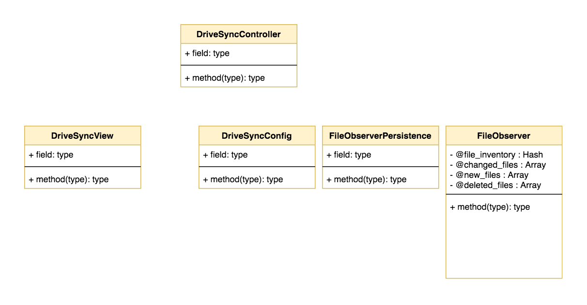
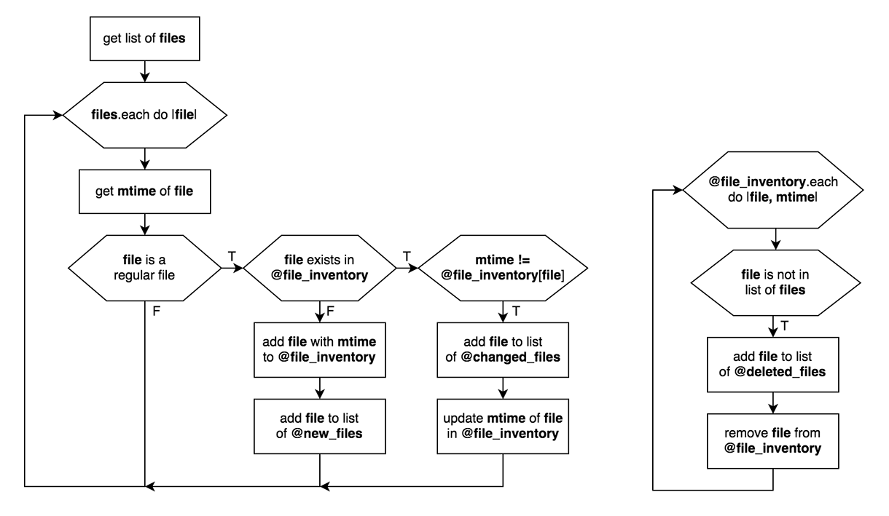

## Programmering 2 - Google Drive Sync

Instruktioner för prog2-projektet Google Drive Sync (läsår 19/20). I detta dokument återfinns instruktioner och tips för hur du implementerar olika klasser som kommer ingå i applikationen. Informationen kommer uppdateras löpande under projektets gång.

### Designmönster Model-View-Controller 

Ett designmönster (design pattern) är ett standardrecept som kan användas för att lösa olika programmeringsproblem. Vi kommer att bygga vår applikation enligt designmönstret MVC, vilket innebär att vi delar in programmets funktionalitet/klasser i tre övergripande kategorier:

  * Model - klasser som hanterar all data som applikationen behöver hantera (även konfiguration)
  * View - klass eller klasser som hanterar användargränssnitt, GUI
  * Controller - i regel en klass som fungerar som ett gränssnitt mellan model och view
  
  
  
Läs på mer om MVC här: [https://www.guru99.com/mvc-tutorial.html](https://www.guru99.com/mvc-tutorial.html)

### Klassdiagram (utkast)

### Klassen FileObserver

FileObserver har som uppgift att bevaka en vald mapp (och dess underliggande mappar) efter förändringar i filsystemet. Klassen initieras med argumentet `target_directory` som är absolut sökväg till bevakad mapp. Ändringar i filer verifieras via filens modified time (`File::mtime`). `@file_inventory` är en förteckning över bevakade filer. Den innehåller nyckel-värde-par där nyckeln är absolut sökväg till filen och värdet är filens mtime. Klassen tillhandahåller tre olika listor (datatyp Array) `@changed_files`, `@new_files`, `@deleted_files` som håller ändrade, nya, respektive borttagna filer. Dessa tre listor är tillgängliga via tre olika getter-metoder. Metoden `FileObserver#update_file_inventory` anropas för att uppdatera `@file_inventory` och dom tre listorna där ändringar kan spåras.

